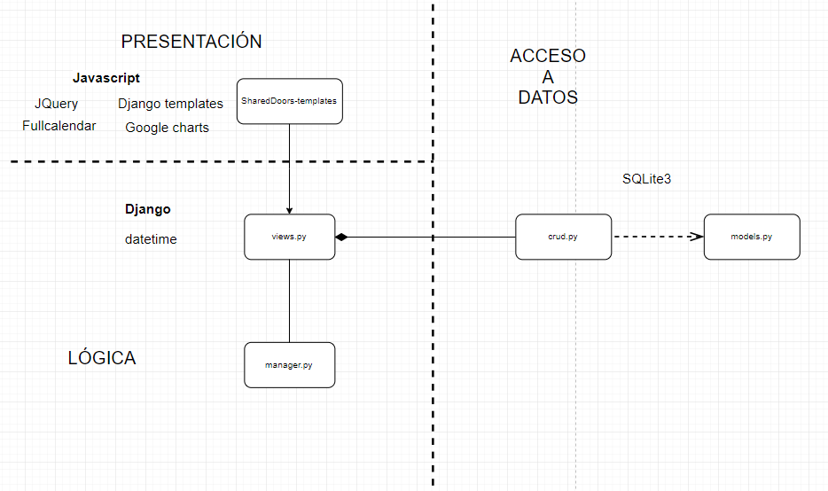
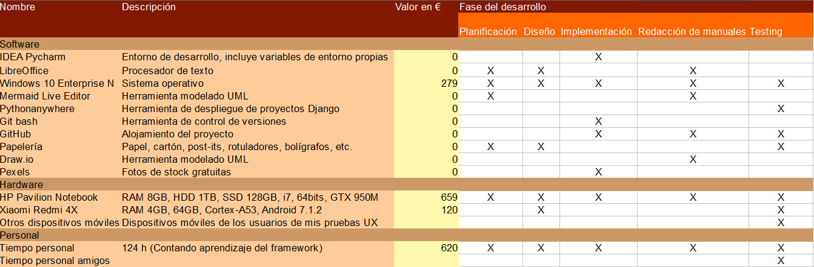

# Shared Doors

**Motivación.**

Mi principal motivación era ~~aprobar~~ poder ofrecer una herramienta a la gente que comparte piso para la fácil gestión de las tareas que este conlleva. Esta inquietud proviene precisamente de estar compartiendo piso y ser alguien un poco olvidadizo.

**Objetivos.**

Los objetivos están definidos como historias de usuario.

Quién? Un estudiante que comparte piso con sus amigos.
Qué? Quiere poder asignar tareas en un calendario virtual.
Para qué? Para llevar un control sobre las tareas realizadas por cada integrante del piso y, a su vez, a modo de recordatorio.

Quién? Un estudiante que comparte piso con sus amigos.
Qué? Quiere poder crear eventos de pago en un calendario virtual, pagables desde ahí mismo. 
Para qué? Para no tener que preocuparse por ir al banco cada vez que le toca pagar el alquiler y/o un servicio.

Quién? Un estudiante que comparte piso.
Qué? Quiere poder tener un registro del menú acordado por todos los compañeros de piso al principio de la semana.
Para qué? Porque está cansado de gastar papel haciendo esquemas semanales y colgarlo en la nevera cada semana.

Quién? Un estudiante que comparte piso.
Qué? Quiere un sistema de puntuaciones con gráficos sobre las tareas completadas en el piso.
Para qué? Para, además de dar un poco de competitividad a hacer las cosas bien, sentirse más motivado para realizar dichas tareas.

Quién? Un olvidadizo estudiante que comparte piso.
Qué? Quiere poder apuntar recordatorios en una agenda virtual.
Para qué? Para no olvidar eventos que le puedan incumbir a él o a varios integrantes de su vivienda.

**Demostración del funcionamiento de la aplicación, en base a los objetivos definidos en el anteproyecto.**

0- Base de datos, a tener en cuenta en siguientes demostraciones

1- Registro, log in, creación de pisos y unión a pisos.

2- Calendario: 

·Creación de diferentes eventos, edición, eliminación y     modificación de usuarios de estos.

·Modo mes, semana y dia.

·Tareas y puntos

3- Scores: Modo mensual y modo total

4- Navbar con opciones de log out, dejar piso y eliminar cuenta

**Descripción técnica:**

1. **Arquitectura de la aplicación y tecnologías utilizadas.**

El proyecto consiste en la realización de una aplicación web orientada a móvil. Para ello se usará la arquitectura de tres capas que permiten una fácil suma de funcionalidades, mantenimiento y modificación gracias a la división lógica de la capa de presentación, la capa lógica o de negocio y la capa de datos (con su correspondiente base de datos).

Capa de presentación:

Presenta y recoge la información del usuario. Para la implementación de la capa se usarán las funcionalidades del framework de Django con Bootstrap, incluyendo HTML, CSS y JS (Con JQuery) además de Google charts y fullcalendar.

Capa de negocio:

Se comunica con ambas capas para recibir peticiones de usuario, hacer peticiones a la base de datos o procesarlas con la propia lógica de esta capa y ofrecer una respuesta al usuario. Se ha escogido python como lenguaje de programación debido a la experiencia de la que dispongo haciendo lógica en este lenguaje y su fácil prototipado y lectura.

Capa de datos:

Esta capa se encarga de ofrecer a la capa de negocio un acceso a los datos. Se ha escogido SQLite3 como base de datos por su fácil uso y adecuación al pequeño proyecto. Para las funcionalidades CRUD se usarán los modelos de Django.

2. **Diagrama de clases.**

3. **Diagrama E/R de la base de datos.**

**Bold** representa Primary key, *Cursive* representa Foreign key.

El modelo presenta tres entidades:

·Flat-> Representa el piso o vivienda. (**ID= int**, Name= String, Key= String)

·User-> Representa el usuario. (**ID= int**, Name= String, Password= String, Mail= String, Points_total= int, Points_monthly= int, *Allocation= Flat*)

·Event-> Representa un evento del calendario. (**ID= int**, Name= String, Day= Date, Price= Float, *Allocation= Flat*, Type= enum, *Users= Many-to-Many User*)

Un usuario puede vivir en un mismo piso simultáneamente, mientras un piso puede tener varios usuarios dentro.

Un usuario puede tener varios eventos asignados, a su vez un evento puede tener varios usuarios.

Un piso puede tener varios eventos, por contraparte un evento sólo puede tener un piso

**Metodología de desarrollo utilizada.**

En primera instancia se eligió la metodología de cascada, fue rápidamente abandonada al no haber tenido en cuenta que el aprendizaje continuo de un framework que no había tocado me haría retroceder varias veces sobre lo hecho para volver a hacer funcionar toda la rueda.

Debido a esa necesidad que no calculé ni en el anteproyecto ni durante el diseño lógico de la aplicación cambie al desarrollo en espiral a temprana edad del proyecto.

**Diagrama de Gantt previo y final del desarrollo de la app.**

Previo al proyecto:

Posterior al proyecto:

**Análisis y justificación de las diferencias en las estimaciones.**

El diagrama de Gantt pre-proyecto estaba pensado para seguir una metodología en cascada, sin tener en cuenta que el aprendizaje y la investigación son procesos continuos durante todo el proyecto. 

El diagrama de Gantt posterior al proyecto muestra más un desarrollo en espiral que combina la investigación con la implementación y, casi al final de proyecto, vuelve al diseño gracias a varias pruebas por parte de usuarios reales. También muestra cierta precocidad por mi parte al empezar con la investigación y la implementación.

**Presupuesto de la app para el comprador con el coste del software amortizado utilizado en cada fase del ciclo de vida de la app.**

**Conclusiones.**

El desarrollo en cascada no era una buena idea, no puedes pretender aprender a usar un framework sin prototipar nada y en tres semanas y despedirte de volver a informarte sobre este durante las próximas fases del desarrollo. Y más si todavía queda una fase de diseño de por medio.

120 horas me parecen pocas para hacer un proyecto que tenga atención al detalle.

Creo que la fase de planificación se debería haber ejecutado antes de hacer el anteproyecto ya que puede que los objetivos me hayan bailado un poco.

**Extra** 

Durante la fase de diseño me han ayudado todos mis compañeros de piso y algunos amigos en una situación parecida, dándome feedback sobre que les parecería o no útil y usable y que les gustaría ver o no en la aplicación.

También he usado mi pared para tener un esquema claro en todo momento de qué tenía que hacer.

